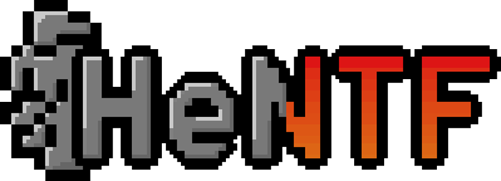

# 1. Game



- [1. Game](#1-game)
  - [1.1. Ganache](#11-ganache)
    - [1.1.1. Building](#111-building)
    - [1.1.2. Running](#112-running)
  - [1.2. Solodity Contracts](#12-solodity-contracts)
    - [1.2.1. Compile](#121-compile)
    - [1.2.2. Compile and migrate](#122-compile-and-migrate)
    - [1.2.3. Init script](#123-init-script)
    - [1.2.4. Debug transaction](#124-debug-transaction)
  - [1.3. IPFS](#13-ipfs)
    - [1.3.1. Upload to IPFS](#131-upload-to-ipfs)
  - [1.4. DApp](#14-dapp)
    - [1.4.1. Development](#141-development)
    - [1.4.2. Build](#142-build)


## 1.1. Ganache

### 1.1.1. Building

```sh
cd ganache
docker build . -t ganache
```

### 1.1.2. Running

```sh
docker run -p 8545:8545 ganache
```

## 1.2. Solodity Contracts


### 1.2.1. Compile

```sh
truffle compile
```

### 1.2.2. Compile and migrate

```sh
export NODE_OPTIONS=--openssl-legacy-provider
truffle migrate --compile-all --reset --network development
```

### 1.2.3. Init script

Start the truffle console:


```sh
truffle console
```

Then execute the following script:

```js

g = await GameToken.deployed();
m = await Market.deployed();
b = await BattleSystem.deployed();
c = await Consumable.deployed();

await g.mint(1, 0, 0, 'QmfEJr9vjKT4MnaF24PfMnTj58rAm45tuccqKohYHKSTZh');
await g.mint(1, 0, 0, 'QmSHa62XeZuT2Ddx15tZbdLgJrvWMBbpnSCVZC61UmcWwT');
await g.mint(1, 0, 0, 'QmQeHuu6B8ztKjFUCDT8MQgjkUzABiHLL7WBR2Jw7vPdLm');
await g.mint(1, 1, 0, 'QmdkYNBh13452PCoaatEBXJSzgBpMCcv4epu4WVDeyQ4Xy');
await g.mint(1, 1, 0, 'QmdUNgcJwvrRxr9Jqt3LXicC2NNQex94gYXGs6bdPYrxHL');
await g.mint(1, 1, 0, 'QmQDkyDgNfzeyE7SwkBra9xqbfSsKLpk9RUDsu4vQLbRBP');
await g.mint(1, 2, 0, 'QmVFL8cAX71SmqF3ydwKoJ3tQ8nBNGyekdVDibpehrWaZY');
await g.mint(1, 2, 0, 'QmVSwUnyfEYLZDJv6mzYQKFumPZRoXn9Cd633yYQfWLuhR');
await g.mint(1, 2, 0, 'QmcLnZdA18XMGiURXswFhHLwdbUHPajbxDV52sYStphFsL');
await g.mint(1, 3, 0, 'QmeXANcW12WvBBzQcTTHp1yLsUhf4D4F2rhjWk4BdVrubf');
await g.mint(1, 3, 0, 'QmNkDwQEUt8H8cA67iKLKLKYMacSvCgeLaJTRMJGWepuE8');
await g.mint(1, 3, 0, 'QmYqsmXCP1GdbXSVvwY46dt3EhruMpshKK3ikKiR6Nt7b2');
await g.mint(1, 0, 0, 'QmXvYQgAPjUfUpwpbRaKCXzQfgKeDFbGThMdjRTMnrBrEr');
await g.mint(1, 0, 0, 'QmTHCbK5ksfRCKPECo1Wbo1LB3H9LKYMmWbD4GgnYcohE1');
await g.mint(1, 0, 0, 'QmVG7quNwWKKg5PFXXN6QUqqUJ3NDrLuVP5WQVFoKZuZbW');

m.allowBuy(0, 1);


i.createAuction(0, (new Date().getTime() + 60000), web3.utils.toWei('1'));
i.bid(0, {value: web3.utils.toWei('1'), from: accounts[8]});
i.bid(0, {value: web3.utils.toWei('1.2'), from: accounts[9]});

web3.eth.getBalance(accounts[0]);
web3.eth.getBalance(accounts[8]);
web3.eth.getBalance(accounts[9]);

```

### 1.2.4. Debug transaction

```sh
truffle debug <TRANSACTION_ID>
```

## 1.3. IPFS


### 1.3.1. Upload to IPFS

```sh
curl -X POST -F file=@1.gif -u "20mcYaDIPn03iUWqbbBDYYLIfhd:ae7ee5b03105365a81cef92a54be9156" "https://ipfs.infura.io:5001/api/v0/add"

```

## 1.4. DApp

### 1.4.1. Development

```sh
npm start
```

### 1.4.2. Build

```sh
npm run build
```
